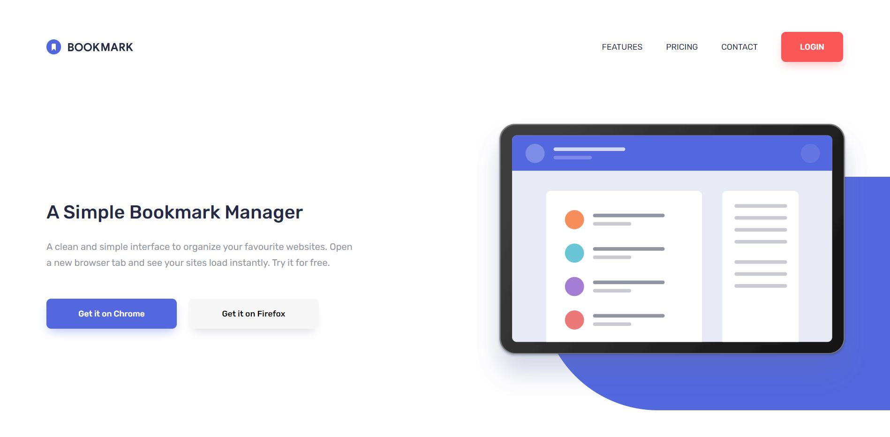
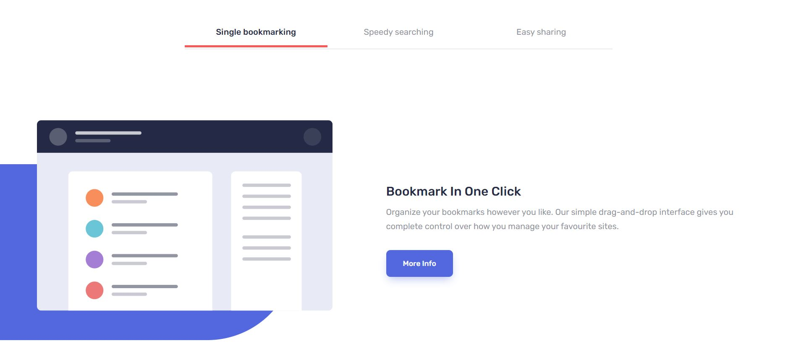
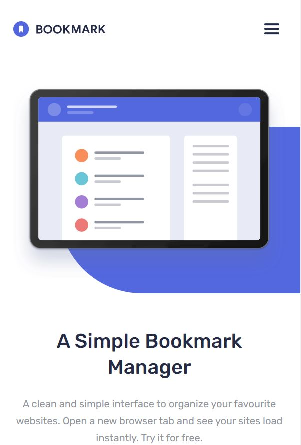
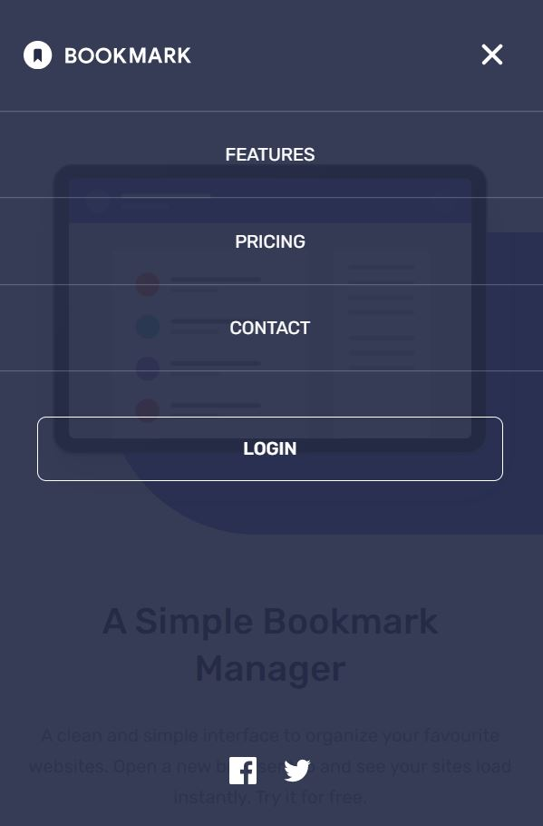

# Frontend Mentor - Bookmark landing page solution

This is a solution to the [Bookmark landing page challenge on Frontend Mentor](https://www.frontendmentor.io/challenges/bookmark-landing-page-5d0b588a9edda32581d29158). Frontend Mentor challenges help you improve your coding skills by building realistic projects. 

## Table of contents

- [Overview](#overview)
  - [The challenge](#the-challenge)
  - [Screenshot](#screenshot)
  - [Links](#links)
- [My process](#my-process)
  - [Built with](#built-with)
  - [What I learned](#what-i-learned)
- [Author](#author)

## Overview

### The challenge

Users should be able to:

- View the optimal layout for the site depending on their device's screen size
- See hover states for all interactive elements on the page
- Receive an error message when the newsletter form is submitted if:
  - The input field is empty
  - The email address is not formatted correctly

### Screenshots









### Links

- Live Site URL: [https://lucid-beaver-2d3206.netlify.app/](https://lucid-beaver-2d3206.netlify.app/)

## My process

### Built with

- Semantic HTML5 markup
- SCSS (with high polished, custom animations and transitions)
- Vanilia JS
- Mobile-first workflow

### What I learned

I tried to build a carousel using as small an amount of js code that I can, so I found interesting CSS property - scroll-snap-type. Example code below:

```css
.carousel {
 ...
 ...
 ...

 &__wrapper {
    display: flex;
    flex: none;
    flex-flow: row nowrap;
    width: inherit;
    height: 100%;
    margin: 0 -24px;
    padding: 0;
    list-style: none;
    -webkit-overflow-scrolling: touch;
    overflow-x: auto;
    scroll-snap-type: x mandatory;
    scroll-snap-stop: always;
    scrollbar-width: none;
    -ms-overflow-style: none;
    scroll-behavior: smooth;

    &::-webkit-scrollbar {
      display: none;
    }
  }

  &__item {
    flex: none;
    width: 100%;
    height: 100%;
    padding: 0;
    margin-right: 160px;
    scroll-snap-align: center;
    overflow: visible;
  }
}
```

## Author

- Frontend Mentor - [@przemg](https://www.frontendmentor.io/profile/przemg)
